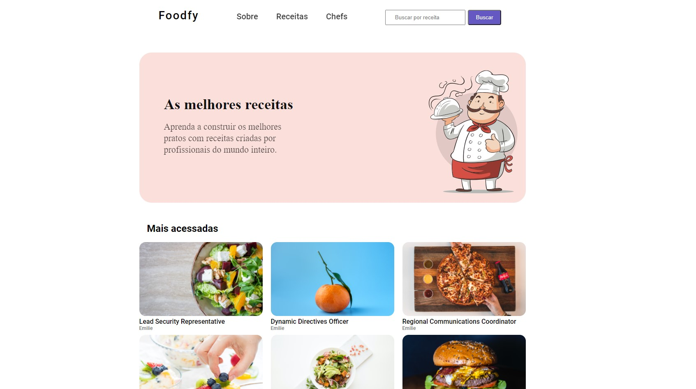
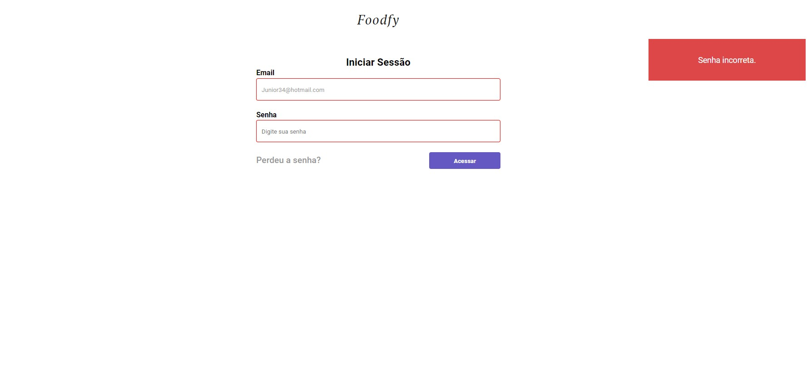

<h1 align="center">
Foodfy
</h1>

<p align="center">Aprenda a construir os melhores pratos com receitas criadas por profissionais do mundo inteiro.</p>

<p align="center">
  
    <a href="https://github.com/AndreTorquato/foodfy/commits/master">
    
  </a>
    
  
  
  <a href="https://opensource.org/licenses/MIT">
    
  </a>
</p>

## Tópicos 
<h3 align="center">
:pushpin:<a href="#sobre-o-foodfy">Sobre o Foodfy</a>
:sparkles:<a href="#funcionalidades">Funcionalidades</a> 
:hammer:<a href="#tecnologias-e-ferramentas">Tecnologias e Ferramentas</a>
:runner: <a href="#instalação-e-uso">Instalação e uso</a>
:page_facing_up:<a href="#licença">Licença</a>

</h3>

<br>

---

## Sobre o Foodfy


O Foodfy é uma aplicação web completa de gerenciamento de receitas, desenvolvida durante o bootcamp [LaunchBase](https://rocketseat.com.br) da [Rocketseat](https://rocketseat.com.br/).
<p align="center">

</p>

<h3 align="center">Home</h3>
<p align="center">
  
</p>

<br>

<h3 align="center">Login</h3>
<p align="center">
  
</p>
<br>
<h3 align="center">Demo</h3>
<p align="center">
  
</p>
<br>

## Funcionalidades

- [X] Explore variados tipos de receitas.
- [X] Gerenciar receitas, chefs e usuários.
- [X] Upload de imagems com Multer.
- [X] Pesquisar receitas.
- [X] Páginas dinâmicas com Nunjucks.
- [X] Banco de dados PostgreSQL.
- [X] Sistema de login e recuperação de senha.
- [X] Área administrativa.

<br>

## Tecnologias e Ferramentas
As seguintes tecnologias foram utilizadas no desenvolvimento do projeto:

- [HTML](https://devdocs.io/html/)
- [CSS](https://devdocs.io/css/)
- [JavaScript](https://devdocs.io/javascript/)
- [Nunjucks](https://mozilla.github.io/nunjucks/)
- [NodeJS](https://nodejs.org/en/)
- [PostgreSQL](https://www.postgresql.org/)
- [Express](https://expressjs.com/)
- [Nodemailer](https://nodemailer.com/about/)
- [Express Session](https://github.com/expressjs/session)
- [Faker.js](https://github.com/Marak/Faker.js)
- [Multer](https://github.com/expressjs/multer)
- [BcryptJS](https://github.com/dcodeIO/bcrypt.js)


<br>

## Instalação e Uso

Para rodar a aplicação, você precisa instalar o [Node](https://nodejs.org/en/) e o banco de dados [PostgreSQL](https://www.postgresql.org/).

Siga os passos abaixo:

```bash
# No seu terminal cole este código:
$ git clone https://github.com/AndreTorquato/foodfy.git
# ou use a opção de download.

# para acessar a pasta:
$ cd foodfy

# Instale as dependências
$ npm install

# Crie o banco de dados e as tabelas utilizando os comandos
# inclusos no arquivo "dbFoodfy.sql".
    
# Conexão com o banco de dados:
# Abra e edite o arquivo "db.js" dentro da pasta "src/config"
# com o seu user e password do Postgres.

# crie uma conta no site https://mailtrap.io
# após cadastrar  SMTP Settings > integrations > Selecione Nodemailer
# copie as credencias
# adicione no projeto: src > libs > mailer.js


# Popule o banco de dados usando o aquivo "seed.js":
$ node seed.js

# Inicialize a aplicação :)
$ npm start
```
<br>

---
**IMPORTANTE:** 

se ocorrer algum erro devido as imagens no projeto a uma pasta chamada `public/backup_images`, copie todas as imagens e cole dentro da `public/images`.
<br>
**ESSA APLICAÇÃO FOI FEITA NO WINDOWS SE HOUVER ALGUM ERRO PARA CARREGAR AS IMAGES PODE SER QUE SEJA POR MOTIVOS DAS `"/"`**

---

### Acessando a Área Administrativa

Selecione um email da tabela **users** gerada pelo `seeds.js`, acesse a tela de login e entre utilizando o mesmo com a senha **"admin"** (senha padrão).

---
### Criando Novos Usuários e Recuperação de Senha

Para usar estes recursos, edite o arquivo `mailer.js` dentro da pasta `scr/lib` com suas credenciais.

<br>

## Licença
<a href="https://opensource.org/licenses/MIT">
    
</a>

<br>

Esse projeto está sob a licença MIT. Veja o arquivo [LICENSE](/LICENSE) para mais detalhes.

---
 
 <br />
 <sub>By :zap: <b>André Torquato</b></sub> 

<br>
<br>

[](https://www.linkedin.com/in/andretorquatoo/) 
